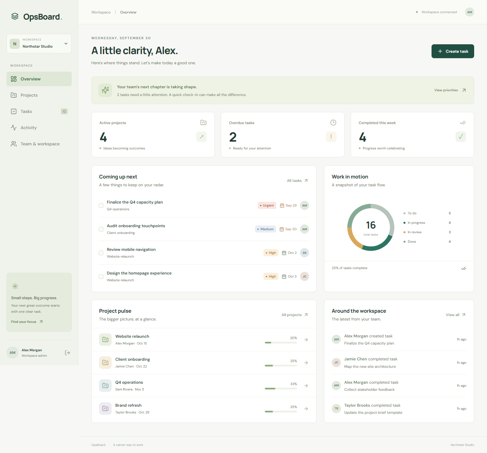
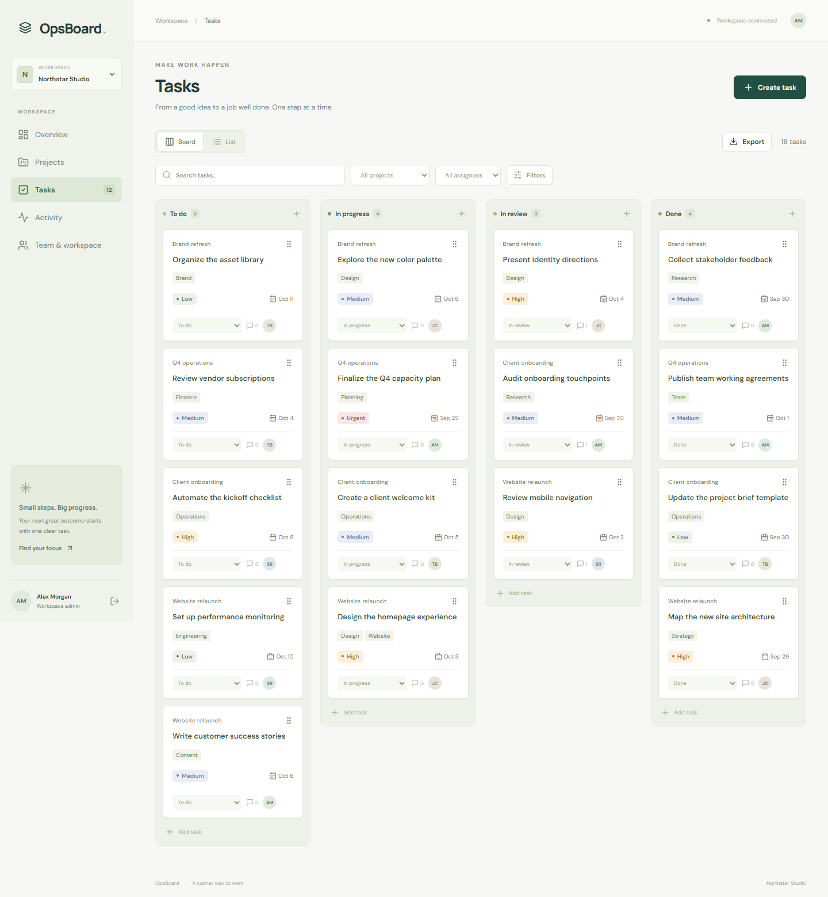
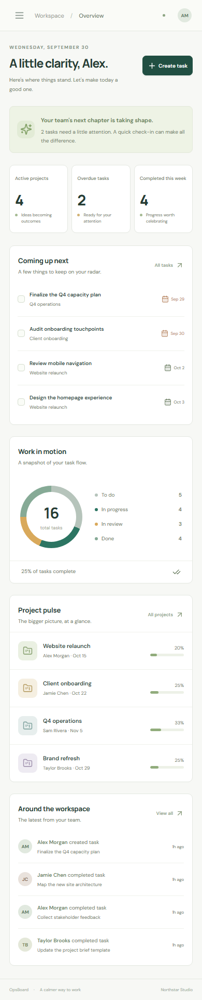
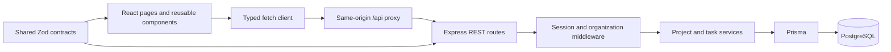

# OpsBoard

**A calmer way to keep a small company's projects, people, and daily work moving.**

OpsBoard is a full-stack internal operations application with multi-organization accounts, project ownership, task workflows, comments, and a live dashboard. It is designed as a portfolio project with a working PostgreSQL backend and a complete UI, rather than a collection of mocked screens.

## Demo

After seeding, click **Explore the demo workspace** on the sign-in screen.

| Field        | Value               |
| ------------ | ------------------- |
| Email        | `demo@opsboard.app` |
| Password     | `OpsBoardDemo!2026` |
| Organization | Northstar Studio    |

These are intentionally public **demo credentials**, not production secrets. The sample workspace contains four teammates, four projects, sixteen tasks, comments, and activity. Demo changes are shared by everyone using that database. Register a separate account and create your own workspace to explore tenant isolation.

## Screenshots

Actual browser captures of the running application are included in `docs/screenshots/`.





## Features

- Register, sign in, sign out, persistent sessions, and protected routes.
- Create or join multiple organizations with admin-managed invitation codes.
- Create, edit, archive, and restore projects; assign owners, deadlines, descriptions, and statuses.
- Create and edit tasks with assignee, priority, deadline, status, project, and tags.
- Kanban drag-and-drop, accessible status menus, table view, and CSV export of filtered results.
- Comments and activity records for project/task changes, completions, assignee changes, and comments.
- Dashboard with active projects, overdue tasks, completions this week, status chart, upcoming work, and recent activity.
- Search title/description and combine filters for project, assignee, status, priority, due date, and tag.
- Desktop, tablet, and mobile layouts, loading states, errors, retries, and empty states.

## Technologies

React 19, TypeScript, Vite 6, React Router, custom responsive CSS, Lucide icons, Node.js 22+, Express 5, PostgreSQL, Prisma 6.19, Zod, bcryptjs, Vitest, Supertest, and Playwright. Versions are reproducible through `pnpm-lock.yaml`. Prisma is deliberately pinned to a known API version; upgrades should be a reviewed migration, not an automatic major bump.

## Architecture



The browser calls relative `/api` URLs. Vite proxies them during development. Vercel rewrites them to the backend in deployment. This allows first-party cookie authentication even when the API has a separate host.

Organization membership is checked before every organization route. Individual records are then fetched using **both resource ID and organization ID**. Foreign project owners and task assignees are rejected. Members can collaborate on projects and tasks; only admins can read or rotate invitation codes. This is a deliberately simple, documented permission model.

Sessions use 32 random bytes. The database stores a SHA-256 digest rather than the bearer token. Cookies are HttpOnly, SameSite=Lax, last seven days, and are Secure in production. Logout deletes the corresponding database session. Passwords are bcrypt hashed at cost 12. Production mutations require the configured browser Origin; this supplements SameSite cookie protection. API responses are marked `no-store`.

Mutations and associated activity records commit in one transaction. Completing a task sets `completedAt`; reopening it clears that timestamp. “Completed this week” starts Monday at 00:00 UTC. Date-picker deadlines are stored at 23:59 UTC on the selected date. Archived projects keep all tasks and comments; those tasks are excluded from current views and metrics until restored.

## Project structure

```text
src/
  components/        Shared UI, editors, layout, cards, activity rendering
  hooks/             Authentication and workspace state
  lib/               Fetch API and presentation helpers
  pages/             Dashboard, projects, tasks, activity, team, sign-in
  types.ts           Frontend response contracts
  styles.css         Responsive design system
server/
  app.ts             HTTP assembly, middleware, errors, route registration
  auth.ts            Session handling and organization authorization
  routes/            Authentication and organization REST handlers
  services/work.ts   Project/task business logic and activity transactions
  db.ts              Prisma client
shared/validation.ts Browser/server Zod contracts
prisma/              Database schema, committed migrations, idempotent seed
tests/               Validation tests, real-database API tests, browser workflows
scripts/             Local database and deployment configuration helpers
.github/workflows/   CI with a PostgreSQL service and browser tests
```

## Installation

Requirements: Node.js **22+**, pnpm **11.19.0**, and PostgreSQL 16+ (or the included local database helper). Docker is optional.

```sh
corepack enable
corepack prepare pnpm@11.19.0 --activate
pnpm install --frozen-lockfile
```

Create `.env` from `.env.example`:

```sh
cp .env.example .env
# PowerShell: Copy-Item .env.example .env
```

### Database setup

Choose one database option; don't start both on the same port.

**Option A: local PostgreSQL helper (no Docker required)**

```sh
pnpm dev:db
```

Keep that terminal open. The helper creates a project-local `.local-db/` directory and listens on `127.0.0.1:54329`. The credentials in `.env.example` are development-only. On Linux run as an ordinary user, because PostgreSQL cannot run as root. The helper does not install a system service or change system users.

**Option B: Docker database**

```sh
docker compose up -d db
```

**Option C: existing local or managed PostgreSQL**

Replace `DATABASE_URL` with its connection string. Use a dedicated database, add `sslmode=require` for hosted services, and never commit the value.

Apply the committed migration history and seed:

```sh
pnpm db:generate
pnpm db:migrate
pnpm db:seed
pnpm dev
```

Open **http://127.0.0.1:5173**. The API runs at port 4000. Use `127.0.0.1` consistently: the configured Origin intentionally differs from `localhost`.

The seed is idempotent: if the demo account exists, it leaves existing data intact. Seeding is not run on every startup or deployment. For schema development use `pnpm exec prisma migrate dev --name descriptive_name` against a development database and commit the resulting migration. Deployment uses `migrate deploy`, which applies existing migrations without resetting data.

### Environment configuration

| Variable          | Purpose                                                                   |
| ----------------- | ------------------------------------------------------------------------- |
| `DATABASE_URL`    | Server-only PostgreSQL connection string                                  |
| `PORT`            | API port; defaults to 4000                                                |
| `APP_ORIGIN`      | Exact browser origin, without trailing slash                              |
| `NODE_ENV`        | `development`, `test`, or `production`; production enables Secure cookies |
| `SERVE_WEB`       | Set `true` to serve the built frontend from Express (Docker/self-hosting) |
| `ALLOW_DEMO_SEED` | Must be `true` to intentionally seed when `NODE_ENV=production`           |

No secret is passed to Vite or embedded in frontend code. `.env` and database files are ignored by Git and Docker.

## Testing

Use a **dedicated test database**. API tests create temporary users/organizations and remove them; browser tests exercise creation flows and therefore write sample data. Never point the test suite at a customer database.

```sh
pnpm check
pnpm test
pnpm exec playwright install chromium
pnpm test:e2e
pnpm build
```

Playwright starts the API and Vite automatically (or reuses existing local servers outside CI). PostgreSQL must already be available, migrated, and seeded. Tests run sequentially in desktop Chromium and a Chromium-emulated iPhone viewport. They cover protected routes, invalid login, session persistence/logout, registration, organization creation, project edits/archiving, task creation/completion, comments, search, priority filtering, list/board views, CSV downloads, and viewport overflow.

API tests use the real Express app and PostgreSQL through Supertest. They assert password hashing, valid/invalid auth, input validation, activity and completion metrics, filters, comments, archive/restore behavior, tenant isolation, foreign record IDs, foreign assignees, admin-only invitation management, invite rotation, and logout revocation. Shared-schema unit tests cover boundaries and normalization.

GitHub Actions provisions PostgreSQL 16, installs locked dependencies, migrates/seeds, builds, and runs both test layers. Failed browser runs retain screenshots and traces; the workflow uploads the HTML report. The hosted workflow executes after you push this repository to GitHub.

## Deployment

Recommended topology: **Vercel frontend → Render API → Neon PostgreSQL**. No paid account or public deployment is provisioned by the source code. Choose current service plans and regions when deploying; free tiers may sleep or change limits.

1. Push this repository to a GitHub repository you own.
2. Create a Neon project and copy a direct PostgreSQL connection string with TLS enabled. For this small, single-instance API, direct connections are simplest. Set a modest `connection_limit=5` if needed. Use the provider's direct connection for migrations; if switching the runtime to a pooler later, configure a separate migration connection.
3. Create a Render Node web service from the repository, or import `render.yaml`. Set `DATABASE_URL` and `APP_ORIGIN` to the final Vercel/custom-domain browser origin. The Blueprint uses locked installation, Prisma generation, and `pnpm build`; startup applies migrations then starts the API. On a paid service, use Render's pre-deploy command `pnpm db:migrate` and change the start command to `pnpm start` so migrations run once per deployment rather than per replica.
4. Generate concrete frontend routing using the **actual backend URL**:

   ```sh
   node scripts/configure-vercel.mjs https://your-real-api.onrender.com
   ```

   Commit the generated `vercel.json`. This creates an `/api` reverse-proxy rewrite before the SPA fallback. Deploy the Vite project to Vercel from this repository with `dist` as output. The generated build/install commands are included. The frontend build does not need database credentials.

5. Confirm `APP_ORIGIN` matches the browser URL exactly and redeploy the API if it changes. Keep `NODE_ENV=production` and HTTPS. Use a separate backend/database for preview deployments, because production rejects other Origins.
6. If this is a public **sample-data-only** portfolio demo, intentionally seed from a trusted shell with the backend's environment:

   ```sh
   ALLOW_DEMO_SEED=true pnpm db:seed
   # PowerShell: $env:ALLOW_DEMO_SEED='true'; pnpm db:seed
   ```

   Do not seed the public account into a private company instance.

7. Verify `/api/health`, register a new user, create a workspace, log out/in, refresh a deep route, create a project/task, and verify a second organization cannot access it. Check that the cookie is Secure/HttpOnly and responses are not cached.

These deployment choices follow [Vercel's external rewrite documentation](https://vercel.com/docs/routing/rewrites), [Render's Prisma deployment guide](https://render.com/docs/deploy-prisma-orm), and the [Prisma 6 migration workflow](https://www.prisma.io/docs/orm/v6/prisma-client/deployment/deploy-migrations-from-a-local-environment).

### Docker / self-hosting

```sh
docker compose up --build
docker compose exec app node dist-server/prisma/seed.js
```

Visit http://127.0.0.1:4000. The supplied Compose file is explicitly for local development (HTTP and development credentials). For public hosting use HTTPS termination, production environment, an exact HTTPS `APP_ORIGIN`, and your own database secrets. Do not publish the PostgreSQL port publicly. The image runs as the unprivileged `node` user. Docker configuration is provided but must be built on a Docker-enabled machine; Docker was unavailable in the development environment.

## Major engineering decisions

| Decision                    | Reason / tradeoff                                                             |
| --------------------------- | ----------------------------------------------------------------------------- |
| PostgreSQL + Prisma         | Explicit relational ownership, indexes, migrations, and type-safe queries     |
| Database sessions           | Persistent, immediately revocable authentication without localStorage tokens  |
| Shared Zod schemas          | Same validation boundaries in browser and API; server remains authoritative   |
| Organization-scoped queries | Tenant access is verified for reads and writes, including referenced IDs      |
| Transactions with activity  | Work changes and their audit entries cannot diverge on partial failure        |
| Archive/restore             | Retains history and avoids accidental data loss                               |
| REST and fetch              | Small explicit API surface without an unnecessary state/network framework     |
| Custom CSS                  | Consistent product design, responsive layouts, and a modest styling toolchain |
| URL-based filters           | Shareable task views and browser navigation that preserve search state        |
| Route code splitting        | Less JavaScript needed for the initial view                                   |

## Known limitations

- Invitation codes are reusable organization-wide secrets until regenerated. There is no email delivery, code expiry, per-person invitation, or member-removal UI.
- No password reset, email verification, MFA, SSO, or account deletion. Public demo registration is open.
- Updates are last-write-wins; there is no optimistic version checking or real-time push. Team members refresh/navigation to see other people's changes.
- Task queries are capped at 500 and activity at 100; pagination is a future feature. The UI shows the returned count. Tag filtering matches an exact tag; search covers title/description.
- Login/register rate limits are in-memory and suited to one API instance. A scaled deployment needs a shared store and verified proxy configuration.
- Expired sessions become unusable immediately but remain in storage until cleaned up; add a scheduled database cleanup in a long-lived production instance.
- Metrics use UTC week boundaries and date-only deadlines use end-of-day UTC, rather than organization-specific time zones.
- Mobile testing uses Chromium emulation, not actual Safari hardware. Automated accessibility audits and broader browser coverage are future work.
- Fonts load from Google Fonts with system fallbacks. External font loading can be disabled/self-hosted for stricter privacy requirements.
- Docker and hosted CI/public deployment configurations are prepared; they are not represented as executed in this local environment.

## Future improvements

Pagination, optimistic concurrency, real-time collaboration, scoped expiring invites, member administration, password recovery, notifications, attachments, organization-specific time zones, accessible browser audits, shared rate limiting, operational monitoring, and database backup/recovery drills.

See [PORTFOLIO_CASE_STUDY.md](PORTFOLIO_CASE_STUDY.md), [docs/API.md](docs/API.md), and [docs/VERIFICATION.md](docs/VERIFICATION.md) for the project narrative, endpoint reference, and verification record.
